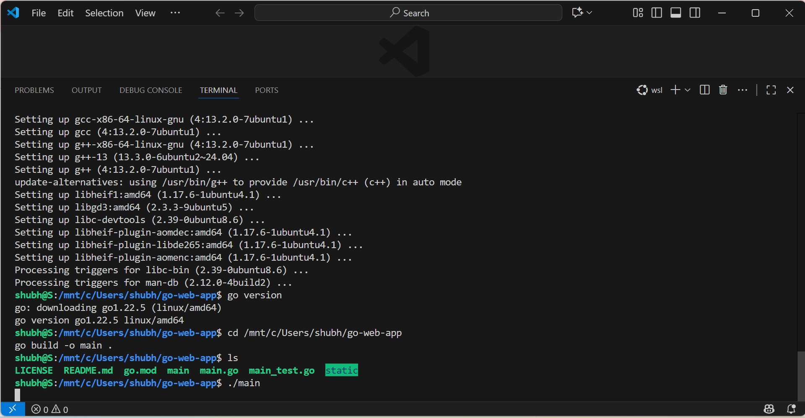
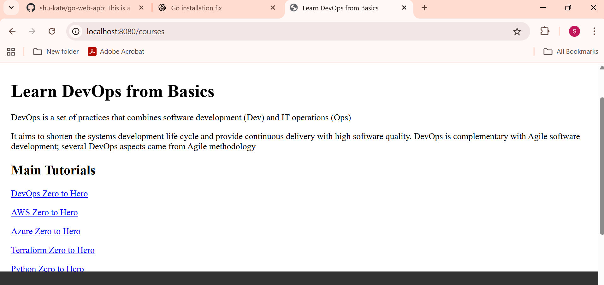
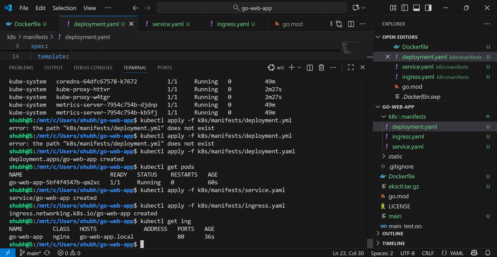
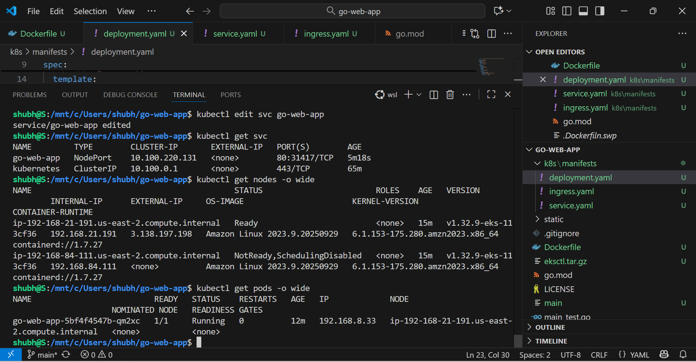
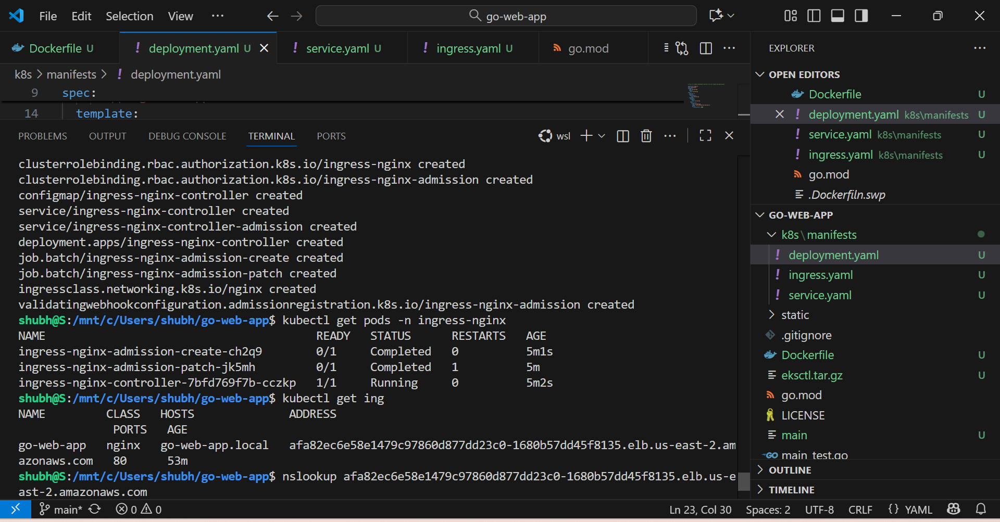
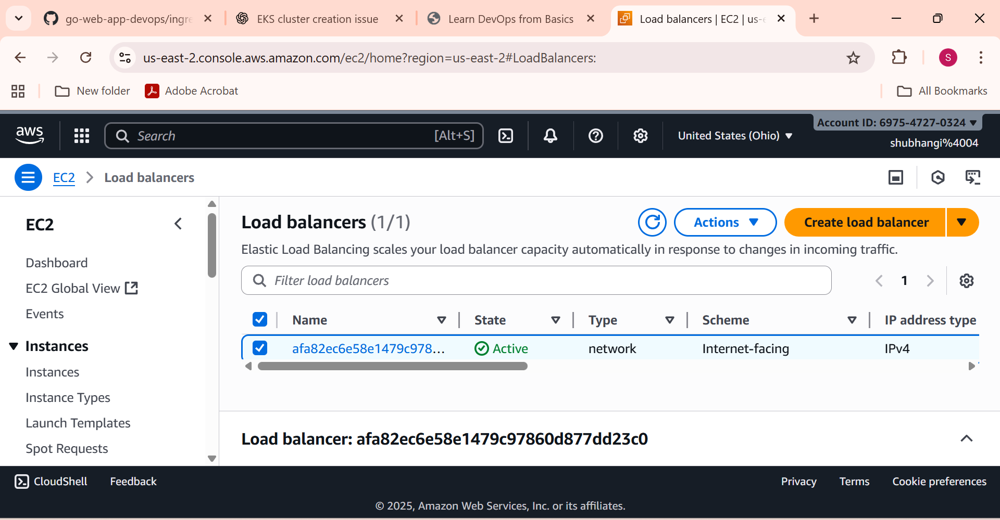
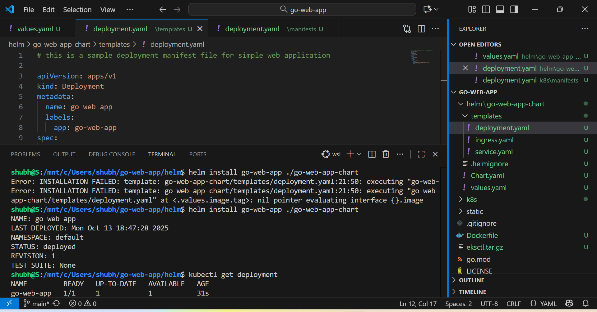
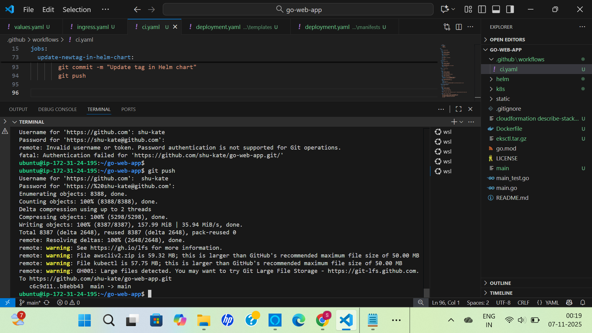
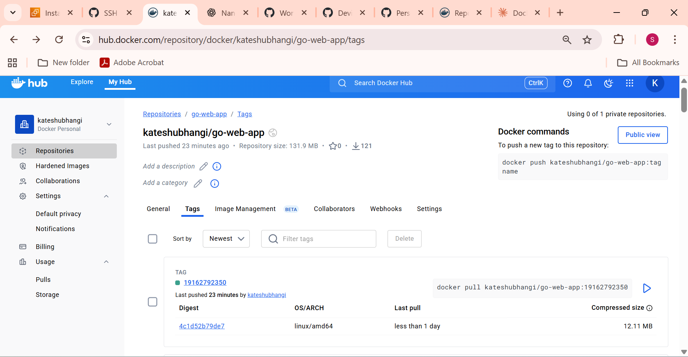
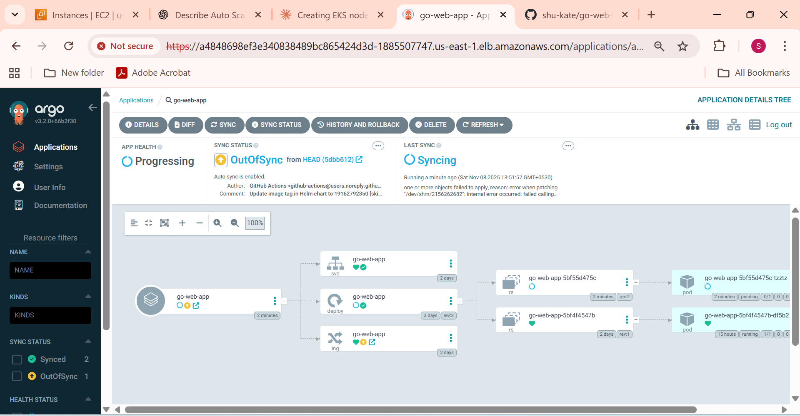

# End-to-End DevOps Implementation on Golang Application

## Project Overview
Complete end-to-end DevOps pipeline for a Golang web application 
deployed on AWS EKS using GitOps principles with Argo CD, 
Helm, Docker, and GitHub Actions.

## What I Implemented
- Containerized Golang app using multi-stage Dockerfile
- Pushed Docker image to Docker Hub (kateshubhangi/go-web-app)
- Created EKS cluster on AWS with worker nodes
- Deployed app to Kubernetes with pods running successfully
- Configured Ingress controller with AWS Load Balancer
- Automated CI pipeline using GitHub Actions
- Implemented GitOps delivery using Argo CD
- Used Helm charts for templated Kubernetes manifests

## Tools and Technologies Used

| Tool | Purpose |
|---|---|
| Golang | Application language |
| Docker | Containerization |
| Docker Hub | Container image registry |
| AWS EKS | Managed Kubernetes cluster |
| Kubernetes | Container orchestration |
| GitHub Actions | CI pipeline automation |
| Argo CD | GitOps continuous deployment |
| Helm | Kubernetes package manager |
| Ingress + Nginx | External traffic routing |
| AWS Load Balancer | Internet-facing traffic |

## Project Architecture
```
Code Push to GitHub
→ GitHub Actions CI triggered
→ Docker image built and pushed to Docker Hub
→ Helm chart updated with new image tag
→ Argo CD detects change in Git
→ Kubernetes deployment updated on EKS
→ App accessible via AWS Load Balancer
```

## Project Screenshots

### 1. Go Application Running Locally


### 2. Web Application Live in Browser


### 3. Kubernetes Pods Running on EKS


### 4. AWS EKS Cluster Nodes Ready


### 5. Ingress and Load Balancer Configured


### 6. AWS Load Balancer Active


### 7. Helm Chart Successfully Deployed


### 8. Code Pushed to GitHub from AWS EC2


### 9. Docker Image on Docker Hub


### 10. Argo CD GitOps Dashboard


## How to Run Locally
git clone https://github.com/shu-kate/go-web-app
cd go-web-app
go run main.go
# App runs on http://localhost:8080
